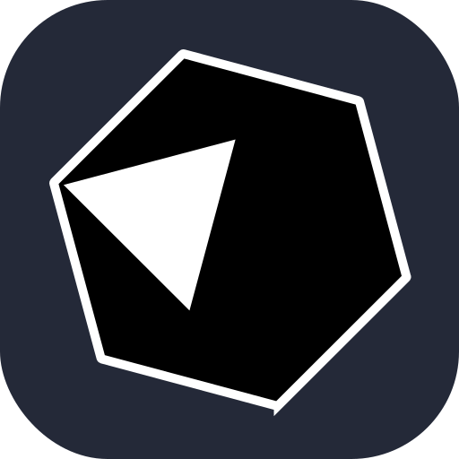
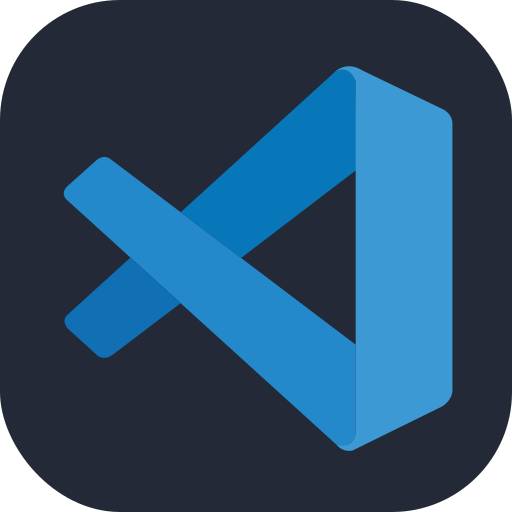
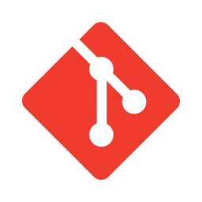

# 🍬 Hello, I'm Kayo, a little programming student.

  Hello! It's a pleasure to have you here. Please allow me to briefly introduce myself.
  <ul>
    <li>💻 I want to be a <b>Software Engineer</b>;</li>
    <li>📍 I am from <b>Brazil 🇧🇷</b>;</li>
    <li>🏢 I am currently studying to get my <b>First Job</b>;</li>
    <li>🌱 I'm currently learning <b>React Native Development</b> with <b>TypeScript</b> and <b>English</b>;</li>
    <li>💬 You can ask me about <b>React Native, TypeScript, Mobile and so on</b>;</li>
    <li>🩸 Living with <b>type 1 Diabetes</b>;</li>
    <li>☕ I do not like <b>Coffee</b>;</li>
    <li>🎛️ I'm unmatched when it comes to <b>Matuê</b>.</li>
  </ul>

  Hello! I’m Kayo Araujo, but you can also call me <em>Balah</em>. Born in 2008, and passionate about <b>mobile development</b>.
  I’m currently studying <b>React Native</b> with <b>TypeScript</b> to start exploring the cross-platform mobile world and create useful and practical apps for everyday life.
  Although I have Type 1 diabetes, I lead a normal life with proper care.
  Alongside coding, I’m also diving into <b>English</b> studies, currently at a beginner level.
  My favorite programming language is <b>Crystal</b>, and I plan to specialize in backend development with it in the future.
  I also dabble in Node.js with <b>JavaScript</b> since it was my first programming language.
  Additionally, I create content on <b>YouTube</b> to share experiences, stories, and some programming tips.
  Feel free to reach out to me through my social media. Cheers! 🚀 &lt;3

---

## 🌐 Find more about me at:

  
  
  
   

---

## 🖥️ My Tech Stacks:

### 📝 Languages:

<table>
  <tr>
    <td align="center" width="110">
      
       TYPESCRIPT
    </td>	
    <td align="center" width="110">
      
       JAVASCRIPT
    </td>
    <td align="center" width="110">
      
       CRYSTAL
    </td>
  </tr>
</table>

---

### 🛠️ IDEs:

<table>
  <tr>
	<td align="center" width="110">
      
       VS CODE
    </td>  
    <td align="center" width="110">
      
       INTELLIJ IDEA
    </td>
  </tr>
</table>

---

### 🔧 Other Tools:

<table>
  <tr>
    <td align="center" width="110">
      
       LINUX
    </td>	  
    <td align="center" width="110">
      
       GIT
    </td>
	<td align="center" width="110">
      
       BUN
    </td>
    <td align="center" width="110">
      
       NODE JS
    </td>
  </tr>
</table>

---

## 📊 Statistics :

	
  
<b>⚡ Github Stats</b>

  
   
        
        

	
  
<b>☄️ Github Streaks</b>

   

  

	
  
<b>⏰ Last Year Coding Time</b>

   

	
  
<b>💬 Discord Profile</b>

   
  

	
   
  
<b>⚙️ Hardware</b>

  	<ul>
  	  <li><b>OS:</b> Ultramarine 41 (KDE 6)</li>
	    <li><b>Laptop: </b> Lenovo IdeaPad 3i</li>
  	  <li><b>Browser: </b> Opera</li>
      <li><b>Cpu:</b> AMD Ryzen™ 5 5500U with Radeon™ Graphics × 12</li>
	    <li><b>Terminal: </b> ZSH: Oh My Zsh (Konsole)</li>
	</ul>	

---

  <h3>Thanks for getting this far! ❤️🍬</h3>
  

